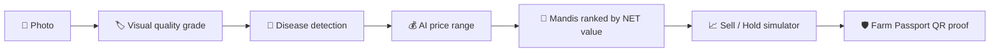
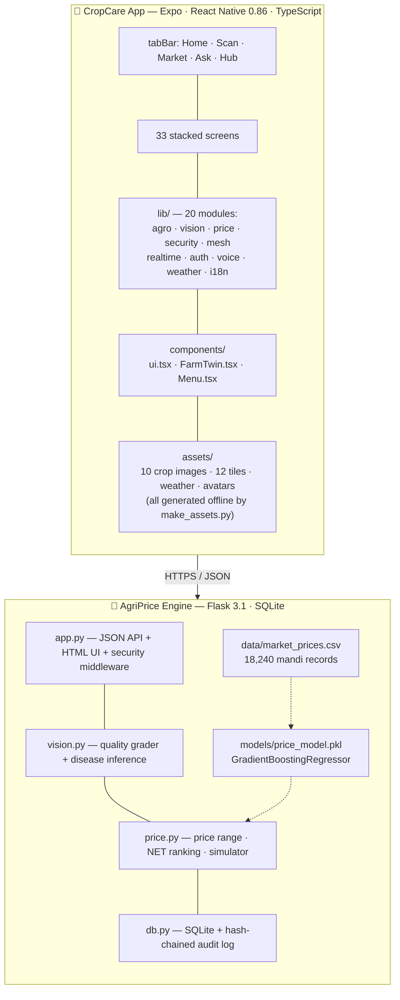
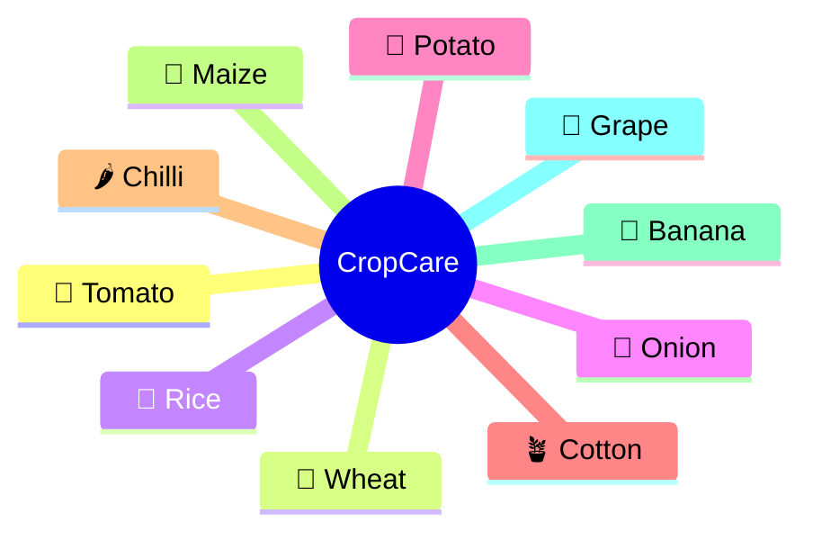
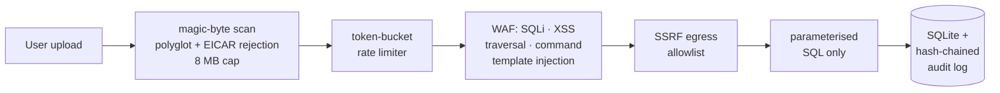

<div align="center">


# 🌱 CropCare

### The Complete AI Farming Platform — Field, Money, Village & Trust in One App

**33 screens · 10 crops · 8 languages · On-device AI · Zero data leaves your server**

[](https://6sh198-jvwt0bm8f-arcadawebapps6.vercel.app/)
[](https://expo.dev)
[](https://reactnative.dev/)
[](https://www.typescriptlang.org/)
[](https://flask.palletsprojects.com/)
[](#-testing)
[](LICENSE)

</div>

---

## 📖 What is CropCare?

CropCare is a **privacy-first, offline-capable farming super-app** built for Indian farmers.
It pairs a cross-platform **Expo app** (Android · iOS · Web) with a self-hosted **Flask AI
engine** that turns one crop photograph into a complete business decision:



> **Honesty contract:** Photographs give *visual* evidence only. Prices are always an
> **80% estimated range** labelled *"AI estimate"* — never a guaranteed price.

---

## 🌟 The Four Pillars

Every tool in the app belongs to one of four groups *(from `lib/menu.ts` — the single
source of truth, with both a **Simple** farmer label and an **Expert** technical name)*:

### 🌿 My Field — *Field Intelligence*
| Tool | Simple mode | Expert mode | What it does |
|---|---|---|---|
| 💧 Irrigation | Water today? | FAO-56 irrigation | How much water the field needs today |
| 📷 Scan | Check my crop | Disease & quality scan | Photograph a leaf or produce |
| 🧊 Twin | What if… | Digital twin simulation | Try changes before you spend money |
| 🗺️ Field Map | Field map | Live map & scouting | Land, position and weak patches |
| 🌾 Crop Detail | About my crop | Crop guide & water needs | Everything about your crop, live |
| 🛰️ Scouting | Satellite view | Sentinel-2 auto-scouting | Automatic satellite crop scouting |
| 🐛 Pest Sentinel | Will it spray safely? | Pest-resistance sentinel | Stop pests adapting to your spray |
| 🌽 Intercrop | Two crops | Intercropping planner | Grow a second crop in the same field |
| 🌻 Seeds | Which seed? | Variety doctor & seed exchange | Pick the right variety, swap seed |
| 📡 AR Spray | Spray check | AR spray verification | Did the spray actually reach the leaf? |
| 🐄 Livestock | My animals | Livestock health | Milk, feed and vaccination reminders |
| ⛈️ Disaster | Storm help | Disaster mode | Before and after a storm |

### 💰 My Money — *Money & Markets*
| Tool | Simple mode | What it does |
|---|---|---|
| 🏪 Market | Best price | Mandi **NET**-price comparison — where you earn the most after costs |
| ❄️ Cold Chain | Store or sell? | Does keeping it longer pay? |
| 🏦 Finance | Loan & cover | FarmScore credit without land papers, fast insurance claims |
| 🚜 Equipment | Rent machine | Hire a tractor or sprayer nearby |
| 👥 FPO | Group money | Shared accounts nobody can change |
| 🌍 Carbon | Earn green | Carbon credits & pollinator badge |

### 🏘️ My Village — *Village Network*
| Tool | Simple mode | What it does |
|---|---|---|
| 💬 Advisor | Ask expert | Offline AI agronomist — ask anything, in your language |
| 🚨 Outbreak | Village alert | Disease Watch radar — news from farms near you |
| 📡 Live | Live now | Realtime event stream of everything happening |
| 🕸️ Mesh | Share data | Works with **no signal**, syncs later |
| 🔒 Secure Chat | Safe chat | Encrypted messages to buyers |
| 👨‍👩‍👧 Family | My family | Let family use parts of the app |
| 🎓 Academy | Learn | 5-minute lessons that pay off |
| 📱 Channels | No smartphone | WhatsApp / SMS / USSD / IVR — works on any old phone |
| 🤖 Robotics | Machines | Valves, sensors and rovers |

### 🛡️ Trust — *Trust & Control*
| Tool | Simple mode | What it does |
|---|---|---|
| 🎫 Passport | Crop proof | A QR that **proves how you grew it** |
| 🔐 Security | Safety | How your data is protected |
| 📊 Dashboard | All numbers | Every figure behind the advice |

---

## 🌍 Language Support

The whole app — UI, voice, and advice — switches together:

| | | | |
|:---:|:---:|:---:|:---:|
| 🇬🇧 English | हिन्दी हिंदी | मराठी | తెలుగు |
| தமிழ் | ಕನ್ನಡ | ગુજરાતી | বাংলা |
| ਪੰਜਾਬੀ | | | |

---

## 🏗️ Architecture



**Runs on:** Android · iOS · Web — deployed on **Vercel**, server ships as **Docker**.

---

## 📂 Project Structure *(real file tree)*

```
CropCare-Marketing/
├── App.tsx                    # Navigation: 5 tabs + 33 stack screens, theming, i18n
├── index.ts                   # Expo entry point
│
├── 📁 screens/                # 33 feature screens
│   ├── WelcomeScreen.tsx          # Language selection onboarding
│   ├── AuthScreen.tsx             # Code / QR sign-in
│   ├── SimpleHomeScreen.tsx       # Farmer home (pinnable tools)
│   ├── HomeScreen.tsx             # Expert dashboard
│   ├── ScanScreen.tsx             # Crop photo scan
│   ├── QualityResultScreen.tsx    # Grade + price results
│   ├── DiseaseResultScreen.tsx    # Diagnosis results
│   ├── MarketScreen.tsx           # Mandi NET-price comparison
│   ├── TwinScreen.tsx             # Digital-twin "What if…"
│   ├── IrrigationScreen.tsx       # FAO-56 water planning
│   ├── AdvisorScreen.tsx          # Offline AI agronomist
│   ├── PassportScreen.tsx         # Farm Passport (QR proof)
│   ├── SecurityScreen.tsx         # Security centre
│   ├── …and 21 more               # Finance, Mesh, Live, Outbreak, Seeds,
│   │                              # Livestock, ColdChain, Carbon, FPO, Academy…
│
├── 📁 lib/                    # Core logic (TypeScript)
│   ├── vision.ts (39 KB)          # On-device image analysis pipeline
│   ├── agro.ts                    # Crop knowledge: 10 crops, water needs, guides
│   ├── agronomist.ts              # Offline AI advisory engine
│   ├── price.ts                   # Price estimation + mandi ranking
│   ├── security.ts                # NaCl crypto, encrypted storage
│   ├── auth.ts                    # Code / QR authentication
│   ├── mesh.ts                    # Offline mesh sync
│   ├── realtime.ts + rtcontext.tsx# Live event stream
│   ├── store.ts                   # App state + AsyncStorage persistence
│   ├── i18n.ts                    # 8-language translations
│   ├── menu.ts                    # Single source of truth for all tools
│   ├── images.ts                  # Offline asset registry (no network at runtime)
│   └── voice.ts · weather.ts · theme.ts
│
├── 📁 components/             # ui.tsx (design system) · FarmTwin.tsx · Menu.tsx
├── 📁 assets/images/          # All artwork generated offline by scripts/make_assets.py
│
├── 📁 e2e/                    # Playwright end-to-end suites
│   ├── 01-auth.spec.ts            # Sign-in flow
│   ├── 02-realtime.spec.ts        # Live stream
│   ├── 03-offline-sync.spec.ts    # Mesh offline sync
│   ├── 04-diagnosis.spec.ts       # Scan → diagnosis
│   ├── 05-passport-security.spec.ts
│   ├── 06-farmer-journey.spec.ts  # Full onboarding journey
│   └── 99-visual.spec.ts          # Visual regression
│
├── 📁 server/                 # 🐍 AgriPrice Engine (Flask + SQLite)
│   ├── app.py                     # JSON API + server-rendered dark UI + WAF middleware
│   ├── vision.py                  # OpenCV-equivalent quality grading + disease inference
│   ├── price.py                   # Price model loader, NET ranking, sell simulator
│   ├── db.py                      # SQLite schema + hash-chained audit log
│   ├── train_model.py             # Trains GradientBoostingRegressor (log price)
│   ├── models/price_model.pkl     # Trained model
│   ├── data/market_prices.csv     # 18,240 mandi records
│   ├── templates/ · static/       # Night-farm dark theme, zero JS dependencies
│   ├── tests/                     # pytest suite
│   ├── openapi.json               # OpenAPI 3 → rendered at /api/docs
│   ├── Dockerfile                 # One-command deployment
│   └── requirements.txt           # Flask 3.1 · numpy · Pillow · scikit-learn · gunicorn
│
├── 📁 scripts/make_assets.py  # Generates all app artwork with Pillow
├── 📁 .github/workflows/      # CI
├── vercel.json                # Web deployment
├── eas.json                   # Android/iOS builds
├── playwright.config.ts       # E2E configuration
└── package.json               # Expo SDK 57 · RN 0.86 · React 19
```

---

## 🌾 Supported Crops



---

## 🔌 API Endpoints

Full contract in `server/openapi.json` → rendered offline at **`/api/docs`**

| Endpoint | Purpose |
|---|---|
| `GET  /api/v1/health` | Liveness, model card, audit chain state |
| `POST /api/v1/analyze` | Multipart photo → grade + price range + markets + simulator |
| `POST /api/v1/price` | Price range for an explicit feature vector |
| `POST /api/v1/markets` | Mandis ranked by **NET** value |
| `POST /api/v1/sell-simulator` | Sell today / +2 d / +5 d |
| `GET  /api/v1/scans` · `/api/v1/audit` | History & tamper-evident log |
| `POST /api/v1/egress-check` | SSRF allowlist decision |
| `POST /api/v1/webhooks/receive` | HMAC-signed webhook receiver |

```bash
curl -F photo=@lot.jpg -F crop=tomato -F quantity=20 \
  http://127.0.0.1:5000/api/v1/analyze | jq '.price'
```

---

## 🚀 Getting Started

### 📱 Run the App

```bash
git clone https://github.com/NallasaniYaswanthReddy321/CropCare-Marketing.git
cd CropCare-Marketing

npm install

npm start          # Expo Dev Tools
npm run web        # Browser  → http://localhost:8081
npm run android    # Android device / emulator
npm run ios        # iOS device / simulator
```

> 💡 Or scan the QR code with **Expo Go** — no build needed.

### 🐍 Run the AgriPrice Server

```bash
cd server
pip install -r requirements.txt

python train_model.py    # writes market_prices.csv + price_model.pkl
python app.py            # → http://127.0.0.1:5000
```

**Docker, one command** (trains the model during image build):

```bash
docker compose up --build
```

---

## 🧪 Testing

```bash
# Backend — pipeline, security & pricing invariants
cd server && python -m pytest -q

# Frontend — end-to-end
npx playwright test
```

**E2E suites:** authentication · realtime stream · offline mesh sync ·
scan-to-diagnosis · passport security · full farmer journey · visual regression

**Backend pytest covers:** quality pipeline · disease multi-label output ·
blemished-vs-clean ordering · upload malware/polyglot rejection · WAF SQLi block ·
SSRF allowlist · HMAC webhook forgery · audit-chain integrity · rate limiting ·
price monotonicity in quality · transport cost models · sell horizons

---

## 🔐 Security (implemented, not just documented)



- 🛡️ Upload magic-byte / polyglot / EICAR scanning, 8 MB cap
- 🪣 Per-IP token-bucket rate limiting
- 🚫 WAF signatures — SQLi, XSS, traversal, command & template injection
- 🌐 SSRF egress allowlist
- 🔑 HMAC-SHA256 webhooks — 300 s replay window, constant-time comparison
- 📱 App side: NaCl cryptography (`tweetnacl`) + encrypted `SecureStore`
- 🧱 CSP / HSTS / nosniff / DENY-framing headers · secrets from environment only

---

## 🤝 Honesty Contract

| Promise | How |
|---|---|
| Visual evidence only | Moisture, brix, residue, internal rot are **never** inferred from photos |
| Never a guaranteed price | 80% estimated range, always labelled *AI estimate* |
| Net, not gross | Markets ranked on gross − transport − commission − transit loss, payment lag shown |

---

## 🗺️ Roadmap

- [ ] Push-notification price alerts
- [ ] More crops & mandis in the training set
- [ ] Full offline-first PWA mode
- [ ] Voice input in all 8 languages
- [ ] Robotics/IoT hardware integrations

---

## 👤 Author

<table>
  <tr>
    <td align="center">
      <a href="https://github.com/NallasaniYaswanthReddy321">
        <br />
        <b>NALLASANI YASWANTH REDDY</b><br />
        <sub>Creator & Maintainer</sub>
      </a>
    </td>
  </tr>
</table>

<table>
  <tr>
    <td align="center">
      <a href="https://github.com/mandapalleumasrikrishna">
        <br />
        <b>Krishna</b><br />
        <sub>Creator & Maintainer</sub>
      </a>
    </td>
  </tr>
</table>
<table>
  <tr>
    <td align="center">
      <a href="https://github.com/TejaBodimandla">
        <br />
        <b>Teja Bodimandla</b><br />
        <sub>Creator & Maintainer</sub>
      </a>
    </td>
  </tr>
</table>
<B>IT IS TEAM WORK

<br>
## 📄 License

Distributed under the **MIT License**. See [`LICENSE`](LICENSE) for details.

---

<div align="center">

**🌾 Made for the farmers who feed us**

[🌐 Live Demo](https://6sh198-jvwt0bm8f-arcadawebapps6.vercel.app/) · [🐛 Report Bug](../../issues) · [✨ Request Feature](../../issues)

**⭐ Star this repo if it helped you!**

</div>
